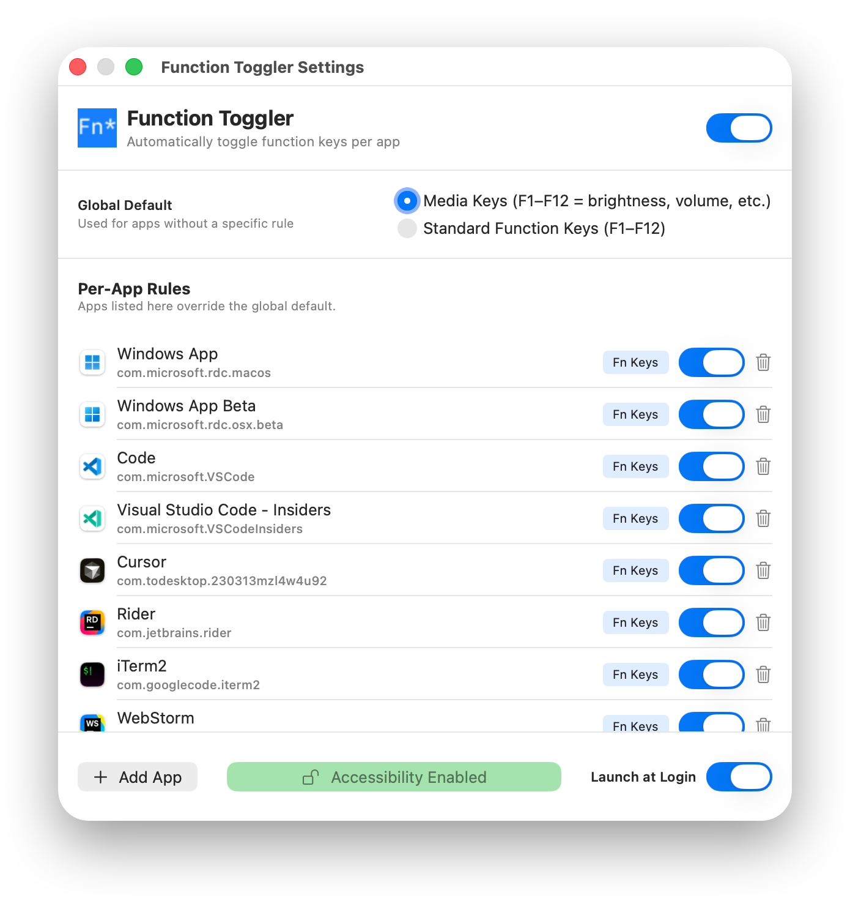
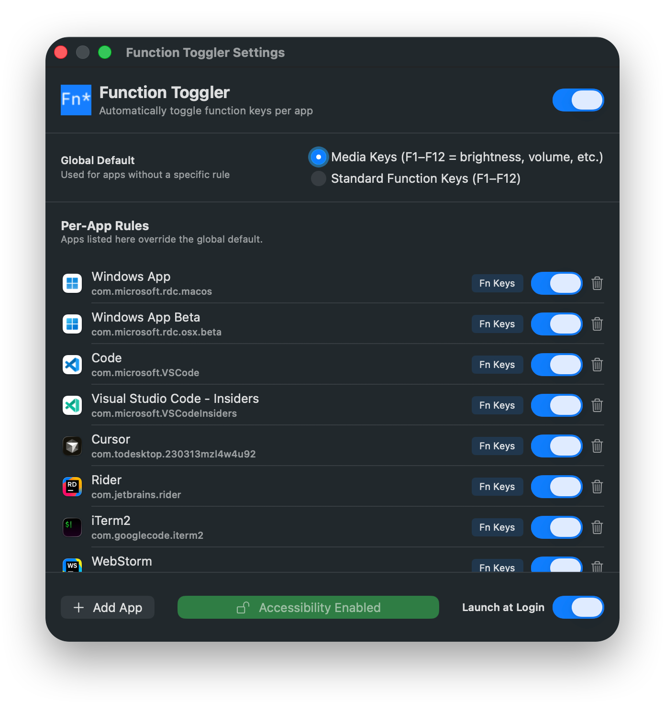

# Function Toggler
**Seamlessly change the Fn key between media and standard modes per-application.**

## Get Started
Download the application and run it. This application runs in the menubar and requires Accessibility permissions so you need to add it under System Preferences. This project was inspired by Fluor (those are the icons you see in the menubar) and since that hasn't been updated in forever I decided to make this.

## Screenshots

### Settings Page

  

    <h4>Light Mode</h3>
    
  

  

    <h4>Dark Mode</h3>
    
  

### Modes

  

    <h4>Media Mode</h3>
    
  

  

    <h4>Standard Mode</h3>
    
  

